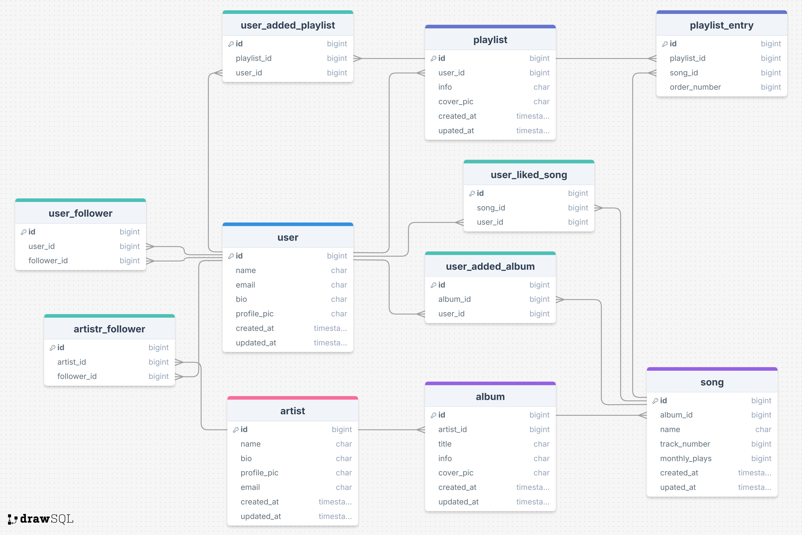

#### Week #028 ~ #029
# 初探 SQL

## A. 專案檔案概覽
關於本專案的檔案分佈可以參考以下簡錄：
- **學習筆記** [``/docs/overview.md``](/docs/overview.md)：<br/>
    關於不同 SQL 語法及用法的筆記，總共分了 14 個章節
- **學習檔案** [``/materials/sqlite_db/*``](/materials/sqlite_db/)：<br/>
    為了輔佐筆記中的 SQL 學習，可以在這個檔案夾裡的 SQLite DB 來做練習
- **實作練習** [``/README.md#b-習作``](#b-習作)：<br/>
    課程最後有提到一些習作題目，我把回答整理在本文的 B 章節中
- **實作材料** [``/materials/exercise_sql/*``](/materials/exercise_sql/)：<br/>
    我為答題在 Spotify 跟 Kaggle 上爬/收集的一些資料，雖然它們都是以無序 (Random) 的方式做收集，但是可以用來驗證回答，與做練習測試之用

## B. 習作
課程最後以 Spotify 為需求藍本，針對其功能給出了一系列的問題，我在本章節給出解答：

### B.1 Schema 設計
收集回來的資料會被整理在以下的 Schema 結構，而習作題目也會以這個 Database 結構做回答。


### B.2 開始步驟
1. 在 **MySQL (v8.0)** 上使用 ``/materials/exercise_sql/`` 裡的 .sql 檔案建立 database，順序如下：
    > 1. spotify_clone_artist.sql
    > 2. spotify_clone_album.sql
    > 3. spotify_clone_song.sql
    > 4. spotify_clone_user.sql
    > 5. spotify_clone_playlist.sql
    > 6. spotify_clone_playlist_entry.sql
    > 7. spotify_clone_user_follower.sql
    > 8. spotify_clone_artist_follower.sql
    > 9. spotify_clone_user_added_playlist.sql
    > 10. spotify_clone_user_added_album.sql
    > 11. spotify_clone_user_liked_song.sql
2. 在 MySQL Command Line console/terminal 上執行 [B.3](#b3-基礎需求)、[B.4](#b4-進階需求) 與 [B.5](#b5-追加需求) 中的 SQL 回答做驗證或測試。

### B.3 基礎需求
- 找到一張專輯裡面的歌 - ``ORDER BY``
    ```sql
    -- 假設我們要找歌的專輯為 "A New Day"，其在 album table 中的 id 為 2
    -- 我們將會用其為 song.album_id 的篩選條件值：

    SELECT
        track_number,
        name
    FROM song
    WHERE album_id = 2
    ORDER BY track_number;

    /* 結果：
    +--------------+----------------------------------------------+
    | track_number | name                                         |
    +--------------+----------------------------------------------+
    |            0 | Hello                                        |
    |            1 | Black Curtains                               |
    |            2 | I'm Awesome (Remix) [feat. Mac Lethal]       |
    |            3 | Rock & Roll (Shouts Out Back To The Rappers) |
    |            4 | ??????                                       |
    |            5 | Trying for Kicks - 2002 Remaster             |
    |            6 | Sunshine In You                              |
    |            7 | We Got The Beat                              |
    |            8 | To Live & Die In L.A.                        |
    |            9 | This Is My Life (feat. Lmfao)                |
    +--------------+----------------------------------------------+
    */
    ```

- 找到一首歌所屬的專輯跟創作者 - ``JOIN``
    ```sql
    -- 假設我們要找專輯與創作者的歌曲為 "Don't Speak"，其在 song table 中的 id 為 170：

    SELECT
        song.id AS song_id,
        song.name AS song_name,
        album.title AS album_title,
        artist.name AS artist_name
    FROM song
    LEFT JOIN album
        ON song.album_id = album.id
    LEFT JOIN artist
        ON artist.id = album.artist_id
    WHERE song.id = 170;

    /* 結果：
    +---------+-------------+-------------+-----------------+
    | song_id | song_name   | album_title | artist_name     |
    +---------+-------------+-------------+-----------------+
    |     170 | Don't Speak | B-Sides     | William Mullins |
    +---------+-------------+-------------+-----------------+
    */
    ```

- 找到使用者 Liked Songs - ``CTE / Subquery``
    ```sql
    -- 假設使用者為 "Emily Shelly" 其在 user table 中的 id 為 20：

    SELECT
        id AS song_id,
        name AS song_name
    FROM song
    WHERE id IN ( 
        SELECT song_id
        FROM user_liked_song
        WHERE user_id = 20
        ORDER BY user_liked_song.id
    );

    /* 結果：
    +---------+---------------------------------+
    | song_id | song_name                       |
    +---------+---------------------------------+
    |     341 | When The Music Stops - Live     |
    |     237 | I Used To Love H.E.R.           |
    |      27 | Funk You Up - Long Version      |
    |     406 | Everything Now                  |
    |      18 | Late Night Feelings             |
    |     292 | Generations                     |
    |     ... | ...                             |
    |     221 | Melmanos Annimos                |
    |     254 | Bad Guy                         |
    +---------+---------------------------------+
    257 rows in set (0.00 sec)
    */
    ```

- 找到一個創作者的月總觀看數 - ``GROUP BY``

    ```sql
    -- 假設指定的創作者是 "Taylor Swift"，她在 artist table 中的 id 為 4：

    SELECT
        at.id AS artist_id,
        at.name AS artist_name,
        SUM(sg.monthly_plays) AS artist_total_monthly_plays
    FROM artist AS at
    INNER JOIN album AS ab
        ON ab.artist_id = at.id
    INNER JOIN song AS sg
        ON sg.album_id = ab.id
    WHERE at.id = 4
    GROUP BY at.id, at.name;

    /* 結果：
    +-----------+--------------+----------------------------+
    | artist_id | artist_name  | artist_total_monthly_plays |
    +-----------+--------------+----------------------------+
    |         4 | Taylor Swift |                22531986749 |
    +-----------+--------------+----------------------------+
    */
    ```

- 找到月總觀看數超過一百萬的發燒創作者 - ``GROUP BY ... HAVING``
    ```sql
    -- 考慮我這次準備的資料量比較龐大，月總播放數動輒超過一百億
    -- 因此，我把條件從 月總播放數超過一百萬 更改為 超過兩百億 (20,000,000,000)

    SELECT
        at.id AS artist_id,
        at.name AS artist_name,
        SUM(sg.monthly_plays) AS artist_total_monthly_plays
    FROM artist AS at
    INNER JOIN album AS ab
        ON ab.artist_id = at.id
    INNER JOIN song AS sg
        ON sg.album_id = ab.id
    GROUP BY at.id, at.name
    HAVING artist_total_monthly_plays >= 20000000000;

    /* 結果：
    +-----------+-----------------+----------------------------+
    | artist_id | artist_name     | artist_total_monthly_plays |
    +-----------+-----------------+----------------------------+
    |         2 | 2Pac            |                23614153105 |
    |         4 | Taylor Swift    |                22531986749 |
    |         8 | Top Drawer      |                24296851581 |
    |        11 | William Mullins |                22348466270 |
    +-----------+-----------------+----------------------------+
    */
    ```

- 使用者對一首歌按愛心 - ``INSERT``
    ```sql
    -- 假設使用者 "Wallace Evans" (user.id:27) 對
    -- 歌曲 "Our Generation" (song.id:204) 按了愛心

    INSERT INTO
        user_liked_song (song_id, user_id)
        VALUES (204, 27);

    /* 結果：
    Query OK, 1 row affected (0.00 sec)
    */
    -- 注意！若你重複執行以上 SQL 會有以下錯誤訊息：
    -- ERROR 1062 (23000): Duplicate entry '204-27' for key 'unq_song_user_pair'

    -- 原因：因為考慮到一個用戶是沒有辦法重複對同一首歌加愛心，
    -- 因此我設定了 UNIQUE(song_id, user_id) 的 CONSTRAINT
    ```

- 創作者更新封面圖片和自我介紹 - ``UPDATE``
    ```sql
    -- 假設使用者為 "Helen Abbott" (user.id:2)

    UPDATE user
    SET
        profile_pic='https://pbs.twimg.com/profile_images/978932102895951878/8By0mcHO_400x400.jpg',
        bio='搖滾Electronic Music Producer & DJ'
    WHERE id=2;

    /* 結果：
    Query OK, 1 row affected (0.02 sec)
    Rows matched: 1  Changed: 1  Warnings: 0
    */
    ```

- 創作者下架專輯 - ``DELETE``
    ```sql
    -- 假設創作者想要下架的專輯是 "Ain't No Sunshine (feat. Jasmine Pace)" (album.id:42)
    -- 該專輯內收錄了一首歌 "Ghost of You" (song.id:326)

    DELETE FROM album
    WHERE id = 42;

    /* 結果：
    Query OK, 1 row affected (0.01 sec)

    -- 該專輯刪除後，若再去執行查詢已找不到
    mysql> select * from album where id = 42;
    Empty set (0.00 sec)

    -- 原先在該專輯內的歌曲 "Ghost of You"，也一樣找不到了
    mysql> select * from song where id = 326;
    Empty set (0.00 sec)
    */
    ```

- 將歌單中的兩首歌調換顺序 - ``TRANSACTION``
    ```sql
    /* 在歌單 "BTS AS MELHORES 💜" 中有以下 5 首歌：
    mysql> SELECT * FROM playlist_entry WHERE playlist_id = 1 ORDER BY order_number;
    +-----+-------------+---------+--------------+
    | id  | playlist_id | song_id | order_number |
    +-----+-------------+---------+--------------+
    | 148 |           1 |     377 |            0 |
    | 362 |           1 |      42 |            1 | <-
    | 680 |           1 |     492 |            2 |
    | 714 |           1 |      38 |            3 | <-
    | 949 |           1 |     474 |            4 |
    +-----+-------------+---------+--------------+
    -- 假設我們要把第二首 (order_number:1, id:362) 
    -- 跟第四首歌 (order_number:3, id:714) 的順序調換
    */

    -- Step 0: 打開 TRANSACTION 
    START TRANSACTION;

    -- Step 1: 將 id 為 362 的 order_number 儲存到變數中
    SELECT @order_362 := order_number FROM playlist_entry WHERE id = 362 AND playlist_id = 1;

    -- Step 2: 將 id 為 714 的 order_number 儲存到變數中
    SELECT @order_714 := order_number FROM playlist_entry WHERE id = 714 AND playlist_id = 1;

    -- Step 3: 更新 id 為 362 的 order_number 為臨時值以避免違反約束
    UPDATE playlist_entry
    SET order_number = -1
    WHERE id = 362 AND playlist_id = 1;

    -- Step 4: 將 id 為 714 的 order_number 更新為 id 為 362 的儲存值
    UPDATE playlist_entry
    SET order_number = @order_362
    WHERE id = 714 AND playlist_id = 1;

    -- Step 5: 將 id 為 362 的 order_number 更新為 id 為 714 的儲存值
    UPDATE playlist_entry
    SET order_number = @order_714
    WHERE id = 362 AND playlist_id = 1;

    -- Step 6: 查詢改變過後結果是否跟想要的一樣
    SELECT * FROM playlist_entry
    WHERE playlist_id = 1 ORDER BY order_number;
    /*
    +-----+-------------+---------+--------------+
    | id  | playlist_id | song_id | order_number |
    +-----+-------------+---------+--------------+
    | 148 |           1 |     377 |            0 |
    | 714 |           1 |      38 |            1 | <-
    | 680 |           1 |     492 |            2 |
    | 362 |           1 |      42 |            3 | <-
    | 949 |           1 |     474 |            4 |
    +-----+-------------+---------+--------------+
    -- 可以發現歌曲 362 與 714 的位置已經調換！
    */

    -- Step 7: COMMIT 所有指令，完成歌單歌曲調換顺序動作
    COMMIT;
    ```

- 發現原本設計的Table不完美或需求改變 - ``ALTER TABLE``
    ```sql
    -- 假設我們想把原本在 user table 中的 bio column 字串容量加大
    -- 從原來的 varchar(200) 限制改到 varchar(500)

    ALTER TABLE user
    MODIFY COLUMN bio varchar(500);
    ```

### B.4. 進階需求
- Your Library 頁面
    - 使用者取得擁有 Play list 和每個 Play list 裡的歌
        ```sql
        -- 假設使用者為 "Joyce Cook" (user.id:3)
        
        SELECT
            pl.name AS playlist_name,
            sg.name AS song_name
        FROM playlist AS pl
        LEFT JOIN playlist_entry AS et
            ON et.playlist_id = pl.id
        LEFT JOIN song AS sg
            ON sg.id = et.song_id
        WHERE pl.user_id = 3;
        
        /* 結果：
        +--------------------------------------+--------------------------+
        | playlist_name                        | song_name                |
        +--------------------------------------+--------------------------+
        | Bts antigas pq so as melhores, bjos  | What Is It? (Excuse Me)  |
        | Bts antigas pq so as melhores, bjos  | Dont Look Back in Anger  |
        | Bts antigas pq so as melhores, bjos  | Crossover                |
        | Bts antigas pq so as melhores, bjos  | Don't Look Back in Anger |
        | ...                                  | ...                      |
        | Vale Tudo (2025) Trilha Sonora       | Maktub                   |
        | Vale Tudo (2025) Trilha Sonora       | Rock On                  |
        +--------------------------------------+--------------------------+
        26 rows in set (0.01 sec)
        */
        ```
    - 使用者取得所追蹤的 Album 和每個 Album 裡的歌
        ```sql
        -- 假設使用者為 "Jamie Ellsworth" (user.id:44)

        SELECT
            alb.title AS user_following_album_title,
            sng.name AS song_in_album
        FROM user_added_album AS ulb
        LEFT JOIN album AS alb
            ON alb.id = ulb.album_id
        LEFT JOIN song AS sng
            ON sng.album_id = alb.id
        WHERE ulb.user_id = 44;

        /* 結果：
        +------------------------------------+-----------------------+
        | user_following_album_title         | song_in_album         |
        +------------------------------------+-----------------------+
        | Consequncias De Um Corao Machucado | Cat's Meow            |
        | Consequncias De Um Corao Machucado | Generate Some Action  |
        | Consequncias De Um Corao Machucado | Rap Is Outta Control  |
        | Consequncias De Um Corao Machucado | Tetris 2020           |
        | ...                                | ...                   |
        | Metal Health                       | Retro Dance Record    |
        | Metal Health                       | Rock with You         |
        +------------------------------------+-----------------------+
        */
        ```
    - 使用者取得 Liked Playlist 和其中的歌
        ```sql
        -- 假設使用者為 "Paul Roberts" (user.id:35)

        SELECT
            pl.name AS user_liked_playlist,
            sng.name AS song_in_playlist
        FROM user_added_playlist AS upl
        LEFT JOIN playlist AS pl
            ON pl.id = upl.playlist_id
        LEFT JOIN playlist_entry AS pl_ent
            ON pl_ent.playlist_id = pl.id
        LEFT JOIN song AS sng
            ON sng.id = pl_ent.song_id
        WHERE upl.user_id = 35;

        /* 結果：
        +---------------------------------------------+------------------------+
        | user_liked_playlist                         | song_in_playlist       |
        +---------------------------------------------+------------------------+
        | ABRI MINHA BBLIA EM JOAO 20 / Vitor Santana | The Interview          |
        | ABRI MINHA BBLIA EM JOAO 20 / Vitor Santana | A Gerao Romntica       |
        | ABRI MINHA BBLIA EM JOAO 20 / Vitor Santana | Lost Generation        |
        | ...                                         | ...                    |
        | U2 - As Melhores                            | Rolling in the Deep    |
        | U2 - As Melhores                            | Da Beginning of da End |
        +---------------------------------------------+------------------------+
        */
        ```
- Artist 頁面
    - 取得創作者 TOP 5 歌
        ```sql
        -- 假設創作者為 "James Fortenberry" (artist.id:5)

        SELECT sng.name, sng.monthly_plays
        FROM artist AS art
        LEFT JOIN album AS alb
            ON alb.artist_id = art.id
        LEFT JOIN song AS sng
            ON sng.album_id = alb.id
        WHERE art.id = 5
        ORDER BY sng.monthly_plays DESC
        LIMIT 5;

        /* 結果：
        +-------------------------+---------------+
        | name                    | monthly_plays |
        +-------------------------+---------------+
        | My Generation           |     998014141 |
        | Radio 3                 |     899633899 |
        | Crossover               |     778678929 |
        | Marte                   |     768292373 |
        | Love Will Tear Us Apart |     762172103 |
        +-------------------------+---------------+
        */
        ```
    - 取得創作者發表過的專輯
        ```sql
        -- 假設創作者為 "James Fortenberry" (artist.id:5)

        SELECT
            alb.title AS album_title,
            alb.created_at AS album_relase_time
        FROM album AS alb
        WHERE alb.artist_id = 5
        ORDER BY alb.created_at DESC;
        
        /* 結果：
        +----------------------------------+---------------------+
        | album_title                      | album_relase_time   |
        +----------------------------------+---------------------+
        | Made In Favela                   | 2025-04-10 12:51:05 |
        | Quiet Nights (Slowed and Reverb) | 2024-10-04 17:17:49 |
        | Collected                        | 2018-05-25 17:52:02 |
        +----------------------------------+---------------------+
        */
        ```

    - 使用者取得他的 Followers / Followings
        ```sql
        -- 假設使用者為 "Sharon Partain" (user.id:16)

        SELECT fr.name AS follower_name
        FROM user_follower AS ufr
        LEFT JOIN user AS fr
            ON fr.id = ufr.follower_id
        WHERE ufr.user_id = 16;

        /* 使用者的 followers 結果：
        +------------------+
        | follower_name    |
        +------------------+
        | Charles Hughes   |
        | Helen Abbott     |
        | Joyce Cook       |
        | Betty Little     |
        | ...              |
        | Candice Dubinsky |
        | Victoria Clines  |
        +------------------+
        */

        SELECT fg.name AS following_name
        FROM user_follower AS ufg
        LEFT JOIN user AS fg
            ON fg.id = ufg.user_id
        WHERE ufg.follower_id = 16;

        /* 使用者取得其 followings 的結果：
        +--------------------+
        | following_name     |
        +--------------------+
        | Eduardo Bode       |
        | Thomas Vanhofwegen |
        | Paul Roberts       |
        | Helen Abbott       |
        | ...                |
        | Victoria Clines    |
        | Mary Schrunk       |
        +--------------------+
        */
        ```

### B.5. 追加需求
- 使用者 Follow (使用者 / 專輯 / Public Playlist)
    ```sql
    -- 假設使用者為 "Thomas Vanhofwegen" (user.id:17)

    -- 1. 使用者 follow 另一位使用者 "Richard Adair" (user.id:42)
    INSERT INTO
        user_follower (follower_id, user_id)
        VALUES (17, 42);

    -- 2. 使用者 follow 一張名為 "Collateral Beauty (Original Motion Picture Soundtrack)" 的專輯 (album.id:72)
    INSERT INTO
        user_added_album (user_id, album_id)
        VALUES (17, 72);

    -- 3. 使用者 follow 一個名為 "KLB: S as antigas" 的公眾播方清單 (playlist.id:34)
    INSERT INTO
        user_added_playlist (user_id, playlist_id)
        VALUES (17, 34);
    ```
- 使用者發佈歌單
    ```sql
    -- 假設使用者為 "Eduardo Bode" (user.id:18)

    START TRANSACTION;

    INSERT INTO
        playlist (user_id, name, info, cover_pic)
        VALUES (18, 'Gone Gone Trouble Minded!', 'A raw, soulful mix of bluesy heartache and defiant anthems for a restless spirit.', 'https://thumbnailer.mixcloud.com/unsafe/500x500/extaudio/0/b/1/e/66b4-51b3-4ffd-9190-5994919cf07e');

    -- 運用 LAST_INSERT_ID() 抓取同一個 Session 內
    -- 上一次 INSERT record 中的 AUTO INCREMENT 欄位值
    -- 而這個值就是我們要 INSERT 進 playlist_entry 的 playlist_id
    INSERT INTO
        playlist_entry (playlist_id, song_id, order_number)
        VALUES (LAST_INSERT_ID(), 84, 0),
            (LAST_INSERT_ID(), 2, 1),
            (LAST_INSERT_ID(), 77, 2),
            (LAST_INSERT_ID(), 42, 3),
            (LAST_INSERT_ID(), 55, 4),
            (LAST_INSERT_ID(), 89, 5);

    COMMIT;

    /* 結果：
    mysql> SELECT ety.order_number AS `order`, song.name AS `song_name` FROM playlist_entry AS ety LEFT JOIN song ON song.id = ety.song_id WHERE ety.playlist_id = (SELECT id FROM playlist ORDER BY id DESC LIMIT 1) ORDER BY ety.order_number;
    +-------+----------------------------------+
    | order | song_name                        |
    +-------+----------------------------------+
    |     0 | Come as You Are                  |
    |     1 | The General                      |
    |     2 | Rollin'                          |
    |     3 | Memrias                          |
    |     4 | Ya Omri (feat. Lacrim & Houssem) |
    |     5 | Rock and Roll                    |
    +-------+----------------------------------+
    */
    ```
- 將一首歌加入/移除歌單
    ```sql
    -- 假設以下是我們要執行操作的歌單
    -- "Gone Gone Trouble Minded!" (playlist.id:150)
    /*
    +------+-------------+---------+--------------+
    | id   | playlist_id | song_id | order_number |
    +------+-------------+---------+--------------+
    | 1301 |         150 |      84 |            0 |
    | 1302 |         150 |       2 |            1 |
    | 1303 |         150 |      77 |            2 |
    | 1304 |         150 |      42 |            3 |
    | 1305 |         150 |      55 |            4 |
    | 1306 |         150 |      89 |            5 |
    +------+-------------+---------+--------------+
    */

    -- 加入歌曲 "Fool's Gold" (song.id:125) 至歌單中的
    -- 位置：2 (第三首)
    UPDATE playlist_entry
    SET order_number = order_number + 1
    WHERE playlist_id = 150 AND order_number >= 2;

    INSERT INTO
    playlist_entry (playlist_id, song_id, order_number)
    VALUES (150, 125, 2);

    /* 結果：
    +------+-------------+---------+--------------+
    | id   | playlist_id | song_id | order_number |
    +------+-------------+---------+--------------+
    | 1301 |         150 |      84 |            0 |
    | 1302 |         150 |       2 |            1 |
    | 1307 |         150 |     125 | <- 新歌曲   2 | <- 插入位置為 2
    | 1303 |         150 |      77 |            3 |
    | 1304 |         150 |      42 |            4 |
    | 1305 |         150 |      55 |            5 |
    | 1306 |         150 |      89 |            6 |
    +------+-------------+---------+--------------+
    */

    -- 從歌單移除歌曲 "The General" (song.id:2)
    -- 位置：1 (第二首)
    DELETE FROM playlist_entry
    WHERE playlist_id = 150 AND song_id = 2;

    UPDATE playlist_entry
    SET order_number = order_number - 1
    WHERE playlist_id = 150 AND order_number > 1;

    /* 結果：
    +------+-------------+---------+--------------+
    | id   | playlist_id | song_id | order_number |
    +------+-------------+---------+--------------+
    | 1301 |         150 |      84 |            0 |
    | 1307 |         150 |     125 |            1 | <- 原初的第2首歌已被刪除，
    | 1303 |         150 |      77 |            2 |    被後面的歌曲補上 (song_id:125)
    | 1304 |         150 |      42 |            3 |
    | 1305 |         150 |      55 |            4 |
    | 1306 |         150 |      89 |            5 |
    +------+-------------+---------+--------------+
    */
    ```

## C. 後記：發現不合理的數據紀錄
後來我發現我所建立的數據紀錄有一個不合理的地方，就是用戶其實不可能追蹤 (user_added_playlist) 自己親自創造的播放清單 (playlist)，也就是說 playlist 與 user_added_playlist 之間不應該存在相同的 user_id 與 playlist_id 組合，若你使用以下的 SQL 查詢便能在 user_added_playlist TABLE 中找到這些有問題的數據紀錄：

```sql
SELECT
    uad_pl.id AS id_tbd
FROM playlist AS pl
INNER JOIN user_added_playlist AS uad_pl
    ON uad_pl.user_id = pl.user_id
    AND uad_pl.playlist_id = pl.id
ORDER BY uad_pl.id;
```

後來我用以下的方法把他們都刪除，但進一步我還在想是否有方法可以防止這種情況發生？

```sql
DELETE FROM user_added_playlist
WHERE id IN (
    SELECT id_tbd FROM (
        SELECT uad_pl.id AS id_tbd
        FROM playlist AS pl
        INNER JOIN user_added_playlist AS uad_pl
            ON uad_pl.user_id = pl.user_id
            AND uad_pl.playlist_id = pl.id
        ORDER BY uad_pl.id
    ) AS derived_table
);
```

答案似乎是可以的，只要我
```sql
START TRANSACTION;
DELIMITER //
CREATE TRIGGER check_user_playlist_insert
BEFORE INSERT ON user_added_playlist
FOR EACH ROW
BEGIN
    IF EXISTS (
        SELECT 1
        FROM playlist
        WHERE user_id = NEW.user_id
        AND id = NEW.playlist_id
    ) THEN
        SIGNAL SQLSTATE '45000'
        SET MESSAGE_TEXT = 'Same combination of user_id and playlist_id found in playlists table.';
    END IF;
END//
DELIMITER ;

/*
mysql> SELECT id, user_id FROM playlist WHERE user_id = 14;
+-----+---------+
| id  | user_id |
+-----+---------+
|  79 |      14 | <-
| 146 |      14 |
+-----+---------+
2 rows in set (0.00 sec)
*/

/*
mysql> INSERT INTO user_added_playlist (playlist_id, user_id) VALUES (79, 14);
ERROR 1644 (45000): Same combination of user_id and playlist_id found in playlists table.
*/

```